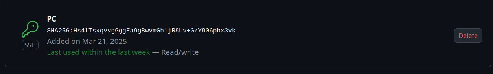
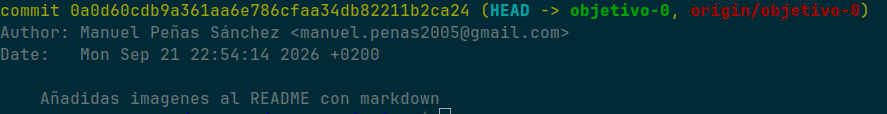

# Gestor Ciclismo

##Problema

Un director deportivo de un equipo de ciclismo debe seleccionar la plantilla de 7 corredores de entre los 20 que suele tener un equipo, de todas las carreras que el equipo tiene durante toda la temporada, y esto es un engorro ya que debe mirar la puntuacion en ranking que ha tenido cada corredor en esa carrera u otras similares otros años para saber cual será el que más puntos le sume al equipo en cada carrera para así ganar el ranking nacional a final de año.

##Para quien va dirigido

Para todos los directivos de equipos ciclistas de carretera, sea de la categoría que sea, quitarles horas y horas de busqueda de información de sus corredores a la hora de elegir la plantilla

##Que datos existen ya

En la página web de la Real Federación Española de ciclismo se encuentra tanto todo el calendario nacional para el año en curso, como las puntuaciones en ranking, de 5 años anteriores de cada corredor en cada carrera.

##Por qué hace falta que esté en la nube

Para empezar, un director deportivo está viajando continuamente y está muy poco en su casa por lo que no deben de depender de una base de datos local, para así poder hacerlo en todo momento y desde cualquier lado. Por otro lado, tanto el calendario como el ranking de puntos se va actualizando semanalmente por lo que no sería viable tenerlo en local

##Fotografías del juego de rol

**Fotografía de la tarjeta de cliente**

**Fotografía de la tarjeta de desarrollador**

**Fotografía de la tarjeta de validación**

##Pruebas de documentación

**Fotografía de comprobacion de las llaves SSH**

**Fotografía de comprobacion de identidad**

